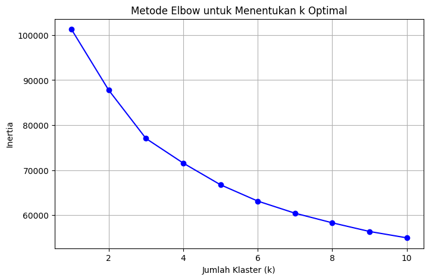
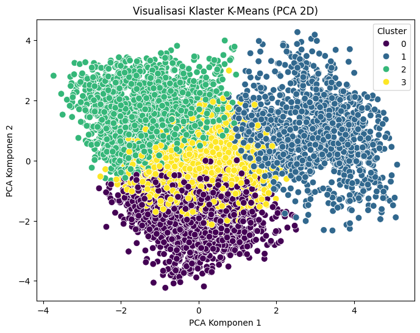

# 📊 Customer Segmentation using K-Means & DBSCAN

Customer segmentation using K-Means and DBSCAN with PCA visualization.

## 🎯 Objectives

* Segment customers based on their characteristics
* Compare clustering results using K-Means and DBSCAN
* Visualize clusters using PCA

## ⚙️ Process

* Data preprocessing (feature selection & cleaning)
* Data normalization using StandardScaler
* K-Means clustering
* Elbow Method & Silhouette Score for optimal cluster
* DBSCAN clustering comparison
* PCA visualization

## 🛠️ Tools & Libraries

* Python
* Pandas
* Scikit-learn
* Matplotlib

## 📈 Results

* Identified customer segments using K-Means
* Visualized clusters in 2D using PCA
* Compared clustering results with DBSCAN

## 📌 Notes

This project is part of my learning journey in Data Analysis and Machine Learning.

## 📊 Visualization

## 📊 Visualization

### Elbow Method

### K-Means Clustering (PCA)

